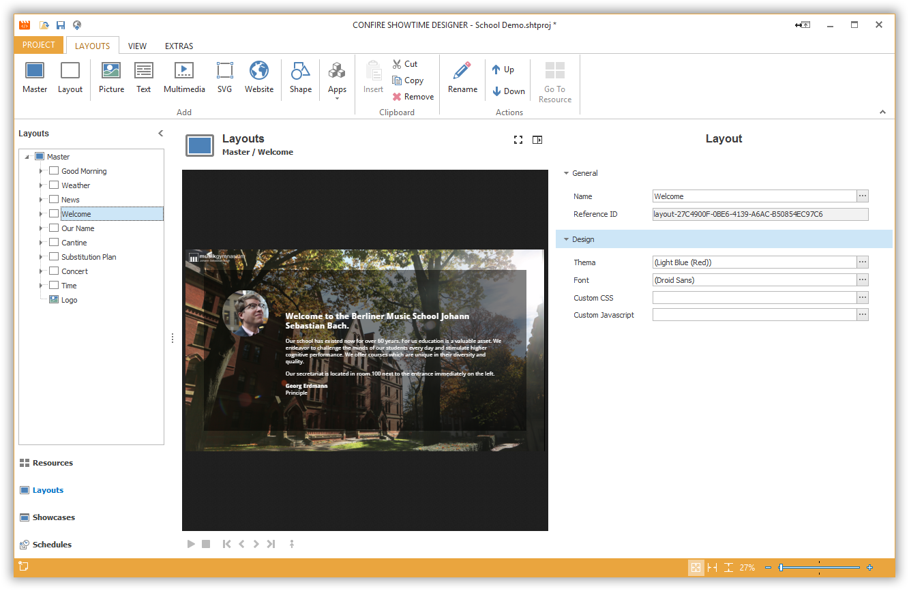

# Managing Layouts

With Layouts you determine the design of a Showcases at the next stage. Layouts contain layout elements such as pictures, text, SVG, panels, multimedia, websites or apps. You can freely position these elements via Drag & Drop and customize them further in a Properties Editor.

Layouts are organized hierarchically. The starting point is always a special layout known as the Master Layout where the target screen resolution is set (e.g. 1920 x 1080 Pixels for Full-HD).

To begin working with Layouts select `Layouts` from the left navigation bar of the Designer.

## Create Layouts

To create a new Master Layout:

1. Click on `LAYOUTS > Master`. A dialog window opens.

2. Enter a meaningful name for your new Master Layout and confirm by clicking `OK`.

Once you created at least one Master Layout you can add additional Layouts underneath:

1. Highlight an existing Master Layout.
 
2. Click on `LAYOUTS > Layout`. A dialog window opens.

2. Enter a name for your new layout and confirm by clicking `OK`.

## Edit Layouts

You can customize all properties of a Layout on the right side in the Properties Editor. If you want to delete a Layout, highlight it, click on `LAYOUTS > Remove` and confirm by clicking `Yes`.

## Addition Chapters

* [Picture Elements](images.md)
* [Text Elements](text.md)
* [Multimedia Elements](multimedia.md)
* [SVG Elements](svg.md)
* [Website Elements](websites.md)
* [Shape Elements](shapes.md)
* [RSS Ticker App](rss-ticker.md)
* [Clock App](clock.md)
* [Weather App](weather.md)
* [DAVINCI App](davinci.md)

