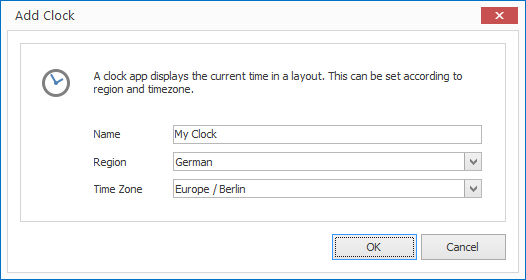

# Clock App

With the Clock app you can display the current time in a layout. Various time zones are supported.

## Add a Clock Element

1. Click on `LAYOUTS > Apps > Clock`. A dialog window opens.

   

3. Enter a meaningful name for the new layout element.

4. Select a region and time zone. 

5. Click `OK` to confirm.

The new clock element is now displayed in the current layout. You can modify the size, position and rotation via Drag & Drop.

## Properties of a Clock Element

When you highlight a clock element in a layout with the mouse all properties of the element are displayed on the right hand side.

As well as all the most common graphical elements you can also configure the following properties for clock elements:

Property       | Description
------------------| ---------
Caption 1    | Free caption (meaning template independent)
Caption 2    | Free caption (meaning template independent)
Region            | Region for Date and Time output
Time Zone          | Current timezone for the time display

[RSS Feeds]: ../../../reference/layouts/rss.md