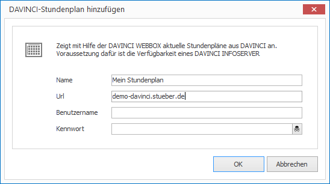
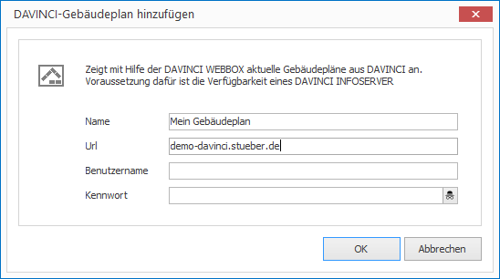

# DAVINCI App

[DAVINCI] is a software for professional timetable, substitution and course planning. 

With the DAVINCI app you can insert timetables, substitution plans and floor plans directly from a [DAVINCI INFOSERVER] onto your layout. The foundation for the display is the completely integrated  [DAVINCI WEBBOX] technology.

## Add a Substitution List

1. Click on `LAYOUTS > Apps > DAVINCI > Substitution List`. A dialog window opens.

   

3. Enter a meaningful name for the new layout element.

4. Enter the `URL` for your DAVINCI INFOSERVER and optionally the `Username` and `Password`.

5. Click `OK` to confirm.

The new DAVINCI element is now displayed in the current layout. You can modify the size, position and rotation via Drag & Drop.

## Add a Timetable

1. Click on  `LAYOUTS > Apps > DAVINCI > Timetable`. A dialog window opens.

   

3. Enter a meaningful name for the new layout element.

4. Enter the `URL` for your DAVINCI INFOSERVER and optionally the `Username` and `Password`.

5. Click `OK` to confirm.

The new DAVINCI element is now displayed in the current layout. You can modify the size, position and rotation via Drag & Drop.

## Add a Floor Plan

1. Click on `LAYOUTS > Apps > DAVINCI > Floorplan`. A dialog window opens.

   

3. Enter a meaningful name for the new layout element.

4. Enter the `URL` for your DAVINCI INFOSERVER and optionally the `Username` and `Password`.

5. Click `OK` to confirm.

The new DAVINCI element is now displayed in the current layout. You can modify the size, position and rotation via Drag & Drop.

## Properties of a DAVINCI Element

When you highlight a DAVINCI element in a layout with the mouse all properties of the element are displayed on the right hand side.

As well as all the most common graphical elements you can also configure the following properties for DAVINCI elements:

### Substitution Lists

Property         | Description
------------------- | ---------
URL                 | URL of your DAVINCI INFOSERVER
Username        | Username a DAVINCI account
Password            | Password of a DAVINCI account
Date               | Either `Today` or `Exact Day`
Day                 | Date specified in `Exact Day`
Deviation          | Deviation from the date (positive or negative)
Display Format       | Indication to be seen how far in the future
Page Switch After  | Switch to the next page after how many seconds?
Update After | Reload from server after how many seconds?
Additional Parameters   | Free parameter entry (See a list of possible parameters on the [DAVINCI WEBBOX] webpages)

### Timetable

Property        | Description
------------------ | ---------
URL                | URL of your DAVINCI INFOSERVER
Username       | Username of a DAVINCI account
Password           | Password of a DAVINCI account
Date              | Either `Today` or `Exact Day`
Day                | Date specified in `Exact Day`
Time               | Either `Now` or `Exact Time`
Time            | Date specified in `Exact time`
Deviation         | Deviation from date and time (positive or negative)
Column Heading | `Date`, `Teacher`, `Class` or `Room`
Display Format      | `Week Display` or `Day Display` by selecting `Date`.
Max. Overlap   | Maximum number of displayed parallel appointments in a cell of the timetable. Otherwise, the dates in the exchange are displayed in sequence.
Additional Parameters  | Free parameter entry (See a list of possible parameters on the [DAVINCI WEBBOX] webpages)

### Floor Plan

Property        | Description
------------------ | ---------
URL                | URL of your DAVINCI INFOSERVER
Username       | Username of a DAVINCI account
Password           | Password of a DAVINCI account
Date              | Either `Today` or `Exact Day`
Day                | Date specified in `Exact Day`
Time               | Either `Now` or `Exact Time`
Time            | Date specified in `Exact Time`
Deviation         | Deviation from day and time (positive or negative)
Floor              | Which floor shall be displayed?
Scaling         | Scaling of the dispaly in percent
Additional Parameters  | Free parameter entry (See a list of possible parameters on the [DAVINCI WEBBOX] webpages)

[DAVINCI]: http://davinci.stueber.co.uk
[DAVINCI INFOSERVER]: http://davinci.stueber.co.uk/davinci-infoserver.php
[DAVINCI WEBBOX]: http://davinci-webbox.stueber.co.uk
