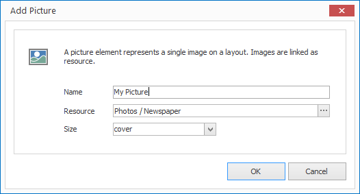

# Picture Elements

With picture elements you can place single pictures on a layout. A requirement of this is a picture resource. 

## Add a Picture Element

1. Click on `LAYOUTS > Picture`. A dialog window opens.

   

3. Enter a meaningful name for the new layout element.

4. Select the appropriate picture resource and confirm by clicking `OK`.

The new picture element is now displayed in the current layout. You can modify the size, position and rotation via Drag & Drop.

## Properties of a Picture Element

When you highlight a picture element in a layout with the mouse all properties of the element are displayed on the right hand side.

As well as all the most common graphical elements you can also configure the following properties for picture elements:

Property  | Description
------------ | ---------
Resource    | Reference to a picture resource
Size        | Display size of a picture. The available values have their counterpart in the CSS property `background-size`. 

