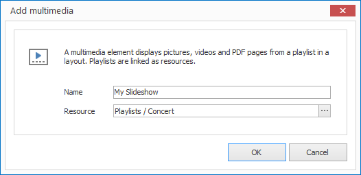

# Multimedia Elements

With Multimedia elements you can play a individual pictures, picture collections, videos, vide collections or PDF pages in a Slideshow in a layout. A requirement of this is a Playlist. 

## Add a Multimedia Element

1. Click on  `LAYOUTS > Multimedia`. A dialog window opens.

   

3. Enter a meaningful name for the new layout element.

4. Select an appropriate playlist and confirm by clicking `OK`.

The new Multimedia element is now displayed in the current layout. You can modify the size, position and rotation via Drag & Drop.

## Properties of a Multimedia Element

When you highlight a Multimedia element in a layout with the mouse all properties of the element are displayed on the right hand side.

As well as all the most common graphical elements you can also configure the following properties for Multimedia elements:

Property        | Description
------------------ | ---------
Resource          | Reference to a picture resource
Volume          | Volume of video sound
Mute              | Should videos be playout without sound?
Continuous Loop    | Should the playlist loop continuously? 
Visual Transition | Visual transition when switching between entries in the playlist
Audio Transition      | Tonal transition when switching between entries in the playlist