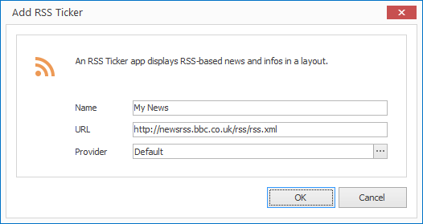

# RSS Ticker App

With the RSS Ticker App you can consume and display [RSS Feeds] in a layout. Since RSS feed content can differ syntactically you can also select between various parsers

## Add an RSS Ticker Element

1. Click on  `LAYOUTS > RSS Ticker`. A dialog window opens.

   

3. Enter a meaningful name for the new layout element.

4. Enter a URL to the RSS feed and select a provider if needed. 

5. Click `OK` to confirm.

The new RSS Ticker element is now displayed in the current layout. You can modify the size, position and rotation via Drag & Drop.

## Properties of an RSS Ticker Element

When you highlight an RSS Ticker element in a layout with the mouse all properties of the element are displayed on the right hand side.

As well as all the most common graphical elements you can also configure the following properties for RSS Ticker elements:

Property       | Description
------------------| ---------
URL               | URL of the RSS Feed
Provider          | RSS Parser
Display Duration  | Display duration when set to static display
Animation Speed   | Display speed of animations

[RSS-Feeds]: ../../../reference/layouts/rss.md