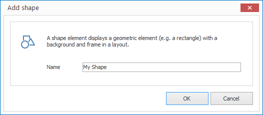

# Shape Elements

With Shape elements you can place geometric elements with content (e.g. a rectangle) on a layout. 

## Add a Shape Element

1. Click on `LAYOUTS > Shape`. A dialog window opens.

   

3. Enter a meaningful name for your new layout element and confirm with `OK`.

The new Shape element is now displayed in the current layout. You can modify the size, position and rotation via Drag & Drop.

## Properties of a Shape Element

When you highlight a Shape element in a layout with the mouse all properties of the element are displayed on the right hand side.

Aside from the most common graphical elements a shape element has no additional specialized properties.
