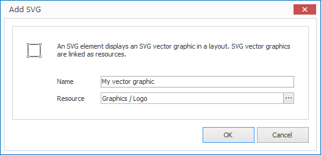

# SVG Elements

With SVG elements you can place vector graphics on a layout. A requirement of this is a SVG resource. 

## Add an SVG Element

1. Click on `LAYOUTS > SVG`. A dialog window opens.

   

3. Enter a meaningful name for the new layout element.

4. Select an appropriate SVG resource and confirm by clicking `OK`.

The new SVG element is now displayed in the current layout. You can modify the size, position and rotation via Drag & Drop.

## Properties of an SVG Element

When you highlight an SVG element in a layout with the mouse all properties of the element are displayed on the right hand side.

As well as all the most common graphical elements you can also configure the following properties for SVG elements:

Property  | Description
------------ | ---------
Resource    | Reference to a SVG resource

