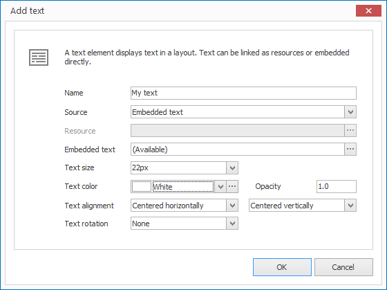

# Text Elements

With text elements you can display text in a layout. Text can be entered directly or linked as a text resource. The text editor in CONFIRE SHOWTIME supports [Markdown].

## Add a Text element

1. Click on `LAYOUTS > Text`. A dialog window opens.

   

3. Enter a meaningful name for the new layout element.

4. Select a `Source` as either `Resource` or `Embedded Text`.

   1. With `Resource` you must select a text resource in the next step.
   2. With `Embedded Text` you can type in text  in the next step.

6.  Make any final changes in the next step then confirm with `OK`.

The new text element is now displayed in the current layout. You can modify the size, position and rotation via Drag & Drop.

## Properties of a Text Element

When you highlight a text element in a layout with the mouse all properties of the element are displayed on the right hand side.

As well as all the most common graphical elements you can also configure the following properties for text elements:

Property        | Description
------------------ | ---------
Source             | Text Resource or enter text directly?
Resource          | Reference to a text resource
Embedded Text | Text Editor
Text Size          | Font Size of Text
Text Color          | Font Color of Text.
Text Alignment    | Horizontal and Vertical alignment of Text
Text Rotation       | Text Rotation
Inner Spacing    | Spacing from the text to the edge of the element.

[Markdown]: ../../../reference/layouts/markdown.md