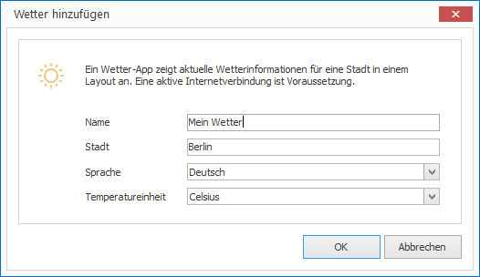

# Weather App

With the Weather app you can display the latest weather information for a given city in a layout.

## Add a Weather Element

1. Click on `LAYOUTS > Weather`. A dialog window opens.

   

3. Enter a meaningful name for the new layout element.

4. Enter the name of the city you want to display the weather information for. 

5. Select language and temperature unit. 

6. Click `OK` to confirm.

The new weather element is now displayed in the current layout. You can modify the size, position and rotation via Drag & Drop.

## Properties of a Weather Element

When you highlight a weather element in a layout with the mouse all properties of the element are displayed on the right hand side.

As well as all the most common graphical elements you can also configure the following properties for weather elements:

Property       | Description
------------------| ---------
City             | City for which the weather information should be displayed
Language          | Language of the information
Temperature Unit | Celsius or Fahrenheit

[RSS Feeds]: ../../../reference/layouts/rss.md