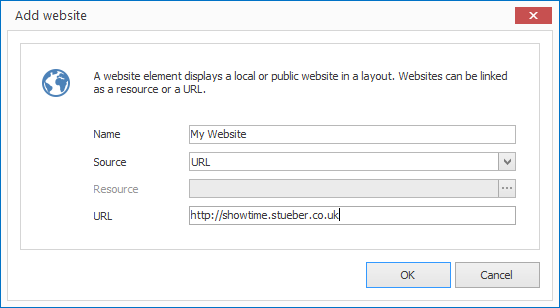

# Website Elements

With website elements you can display your own created HTML pages or live websites from the internet in a layout. 

## Add Website Element

1. Click on  `LAYOUTS > Website`. A dialog window opens.

   

3. Enter a meaningful name for the new layout element.

4. Select as  `source` either `Resource` or `URL`.

   1. With `Ressource` you must select an HTML resource in the next step.
   2. With `URL`  you can type in a URL in the next step.

5.  Change any other properties to suit your needs and then confirm with `OK`.

The new website element is now displayed in the current layout. You can modify the size, position and rotation via Drag & Drop.

## Properties of a Website Element

When you highlight a website element in a layout with the mouse all properties of the element are displayed on the right hand side.

As well as all the most common graphical elements you can also configure the following properties for website elements:

Property              | Description
------------------------ | ---------
Source                   | HTML resource or enter a URL directly?
Resource                | Reference to an HTML resource
URL                      | Website URL
Update           | Type of automatic content update
Update interval | Interval to reload the website
Scaling               | Scaling of the website
Interactive               | Allow interactivity? (i.e. clicking on links)
Hide progress bar     | Should the progress bar be hidden with oversized content?