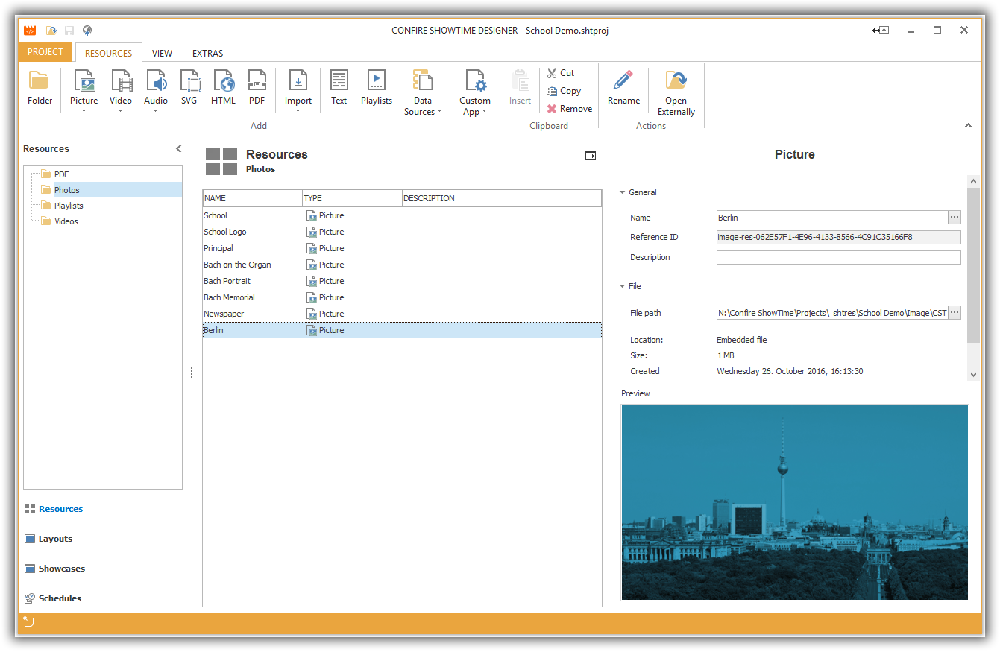

# Managing Resources

Resources form the backbone of a project. Whenever you want to display pictures, videos, graphics, PDFs this is how these media files are deposited. This separation between layouts and resources allows the same resources to be reused multiple times. For example, you can create two layouts in landscape and portrait which both use the same resources. If you exchange a resource e.g. a photo this will be reflected in all the layouts automatically that reference those resources. This can save a lot of time in large projects.

Resources are managed in a hierarchical folder structure. You can switch between resources via Drag & Drop. Visual resources (pictures, videos, graphics, PDFs, etc.) are displayed by an integrated preview panel.

In order to be able to work with Resources you need to click on `Ressources` the left navigation bar of the Designer.

## Create Folder

How to create a new resource folder:

1. Click on `RESOURCES > Folder`. A dialog window will open.

2. Enter a name for your new folder and confirm by clicking `OK`.

## Edit Folder

A folder's only properties are its name. You can change it under `RESOURCES > Rename`. If you want to delete a folder select it, click on `RESOURCES > Remove` and confirm with `YES`.

> #### warning::Warning
> 
> Deleting a folder will result in the deletion of all subfolders and resources contained within them.

## Further Chapters

* [Managing Pictures](images.md)
* [Managing Videos](videos.md)
* [Managing Audio](audios.md)
* [Managing SVG](svg.md)
* [Managing PDF](pdf.md)
* [Managing HTML](html.md)
* [Managing Text](text.md)
* [Managing Playlists](playlists.md) 