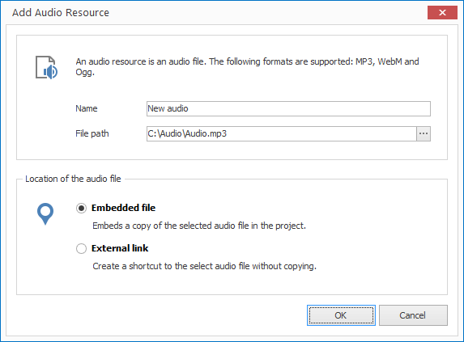
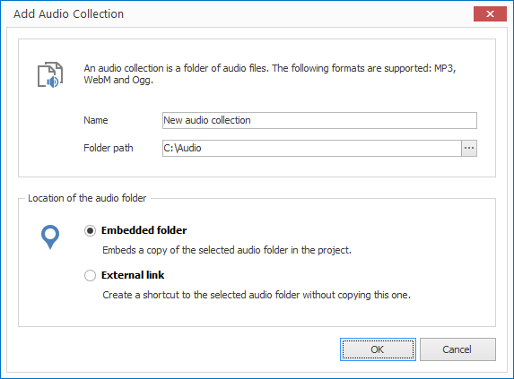

# Managing Audio

When you want to add audio (e.g. music) to your project you first need to decide whether you want to import a single audio file or a whole folder of audio files (audio collection).

An audio collection allows you to play a large amount of audio files consecutively.

## Import an Audio File

1. Click on `RESOURCES > Audio > Audio File`. A dialog window opens to select the file.

2. Select the desired file and confirm by clicking `Open`. Another dialog window opens.
   
   

3. Enter a meaningful name for your new resource. 

4. Select whether you would like to insert your audio file as an embedded file or as an external link. When selecting the first option the file is copied into the project itself  (embedded resource). When selecting the second option the file path is simply saved (external resource).

5. Confirm by clicking `OK`.

## Import an Audio Collection

1. Click on `RESOURCES > Audio > Audio Collection`. A dialog window opens to select the folder.

2. Select the desired folder and confirm by clicking `OK`. Another dialog window opens.
   
   

3. Enter a meaningful name for your new resource. 

4. Select whether you would like to insert your audio files as an embedded folder or as an external link. When selecting the first option the folder is copied into the project itself (embedded resource). When selecting the second option the folder path is simply saved (external resource).

5. Confirm by clicking `OK`.

