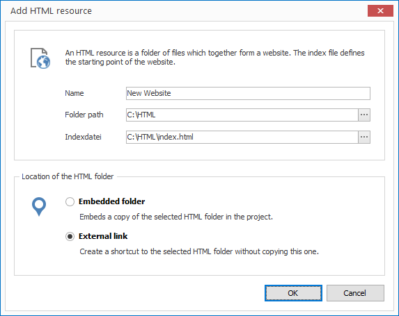

# Managing HTML

When you want to use HTML files in your project you can import a folder with all the necessary files (HTML, CSS, Javascript, Bilder, etc.).

## Import an HTML Resource

1. Click on `RESOURCES > HTML`. A dialog window opens to select the file.

2. Select the desired file and confirm by clicking `Open`. Another dialog window opens.
   
   

3. Enter a meaningful name for your new resource. 

4. Specify an HTML index file. This is the start file which is called in the layout later on.

5. Select whether you would like to insert your HTML files as an embedded folder or an external link. When selecting the first option the files are copied into the project itself  (embedded resource). When selecting the second option the folder path is simply saved (external resource).

6. Confirm by clicking `OK`.
