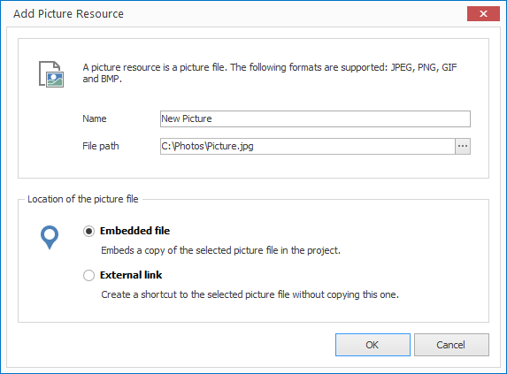
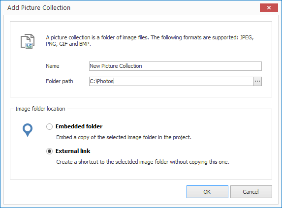

# Managing Pictures

When you want to add pictures (i.e. Photos) to your project you first need to decide whether you want to import a single photo file or a whole folder of pictures (picture collection).

A picture collection allows you to play a large amount of pictures as a slideshow whereas a single picture can also be placed as an element in a layout.

## Import a Picture File

1. Click on `RESOURCES > Picture > Picture File`. A dialog window opens to select the file.

2. Select the desired file and confirm by clicking `Open`. Another dialog window opens.
   
   

3. Enter a meaningful name for your new resource. 

4. Select whether you would like to insert your picture file as an embedded file or as an external link. When selecting the first option the file is copied into the project itself  (embedded resource). When selecting the second option the file path is simply saved (external resource).

5. Confirm by clicking `OK`.

## Import a Picture Collection

1. Click on `RESOURCES > Picture > Picture Collection`. A dialog window opens to select the folder.

2. Select the desired folder and confirm by clicking `OK`. Another dialog window opens.
   
   

3. Enter a meaningful name for your new resource.  

4. Select whether you would like to insert your picture files as an embedded folder or as an external link. When selecting the first option the folder is copied into the project itself (embedded resource). When selecting the second option the folder path is simply saved (external resource).

5. Confirm by clicking `OK`.

