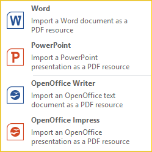

# Integrate Office Documents

CONFIRE SHOWTIME allows you to import Office documents from [Microsoft Office], [OpenOffice] and [LibreOffice] as a PDF ressource. The following document types can be converted:

* Microsoft Word
* PowerPoint Presentations
* Writer Documents
* Impress Presentations

## Requirements

To convert Office documents into PDF format an installation of respective Office application must exist on the computer. The following versions are supported:

* MS Office 2016, MS Office 2013, MS Office 2010
* Apache OpenOffice from version 4.1.2
* LibreOffice from version 5.0.6

The following applies to OpenOffice and LibreOffice: It is highly likely that older versions will also be compatible with CONFIRE SHOWTIME. However, we have only tested the above versions.

## Import an Office file

1. Click on `RESOURCES > Import`. 
   
   

2. In the submenu select the desired output format. A dialog window opens to select the file.
   
3. Select the desired file and confirm by clicking `Open`.

The Office document will now be converted and shortly made available as an embedded as a PDF resource.

## Alternative Methods

You can also generate PDFs directly from Office applications. Just open the desired Office document in the respective Office application and select the corresponding command to convert to PDF.

If you want to convert MS Office documents but don't have access to MS Office you can fall back on Open Source products such as OpenOffice or LibreOffice. Both allow you to import MS Office documents and then indirectly convert them to PDF format.

[Microsoft Office]: https://products.office.com/en-US/?omkt=en-US
[OpenOffice]: https://www.openoffice.org
[LibreOffice]: https://libreoffice.org
