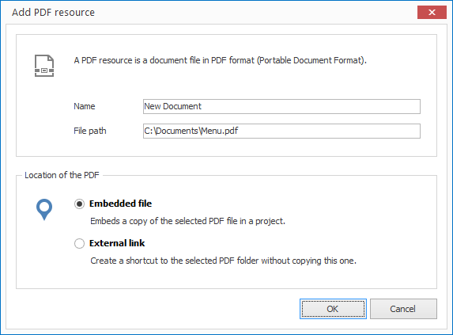

# Managing PDFs

The PDF resource feature allows you to embed PDF files. PDF (Portable Document Format) is a platform-independent file format for documents. It can be generated by other applications (e.g. Microsoft Office).

## Import a PDF File

1. Click on `RESOURCES > PDF`. A dialog window opens to select the file.

2. Select the desired file and confirm by clicking `Open`. Another dialog window opens.
   
   

3. Enter a meaningful name for your new resource. 

4. Select whether you would like to insert your PDF file as an embedded file or as an external link. When selecting the first option the file is copied into the project itself  (embedded resource). When selecting the second option the file path is simply saved (external resource).

5. Confirm by clicking `OK`.

## Create PDF Documents

All modern Office applications (Microsoft Word, Excel, PowerPoint and their equivalents in OpenOffice, LibreOffice etc.) offer a PDF export function which can convert a document, workbook, or a presentation into PDF format.

If you have Microsoft Office or Open Office installed on the same computer as CONFIRE SHOWTIME you can import such documents directly into CONFIRE SHOWTIME:

1. Click on `RESOURCES > Import`. 

2. Click on the desired output format. You can choose between Microsoft Word, Powerpoint, OpenOffice Writer and OpenOffice Impress. A dialog window opens to select the file. 

3. Select the desired file and confirm by clicking `Open`.
   

