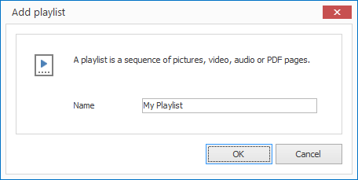
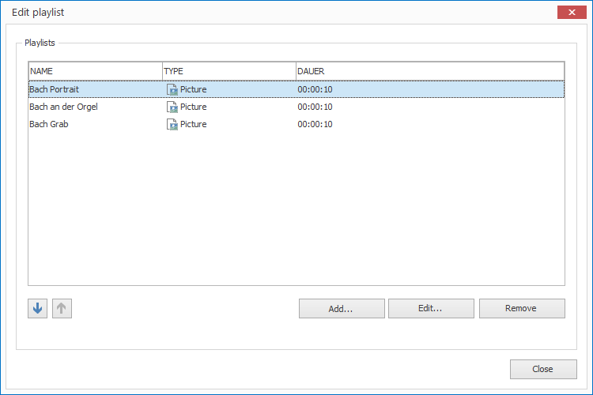

# Managing Playlists

Playlists define a sequence of pictures, videos, audio or PDF pages. They are needed in Layouts to provide multimedia elements with content.

## Create a Playlist

1. Click on `RESOURCES > Playlists`. A dialog window opens.
   
   

2. Enter a meaningful name for your new resource and confirm by clicking `OK`.

3. Double click on the newly created Playlist in the current resource list. A dialog window opens.
   
   

5. Add new entries, edit existing ones or delete them.

