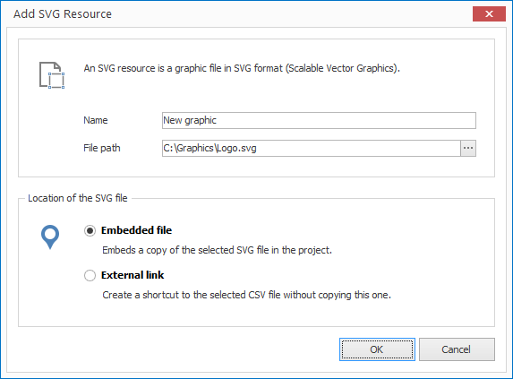

# Managing SVG

SVG graphics allow you to embed vector graphics. The SVG specification is an open standard developed by the World Wide Web Consortium (W3C). 

## Import an SVG File

1. Click on `RESOURCES > SVG`. A dialog window opens to select the file.

2. Select the desired file and confirm by clicking `Open`. Another dialog window opens.
   
   

3. Enter a meaningful name for your new resource.

4. Select whether you would like to insert your SVG file as an embedded file or as an external link. When selecting the first option the file is copied into the project itself  (embedded resource). When selecting the second option the file path is simply saved (external resource).

5. Confirm by clicking `OK`.

