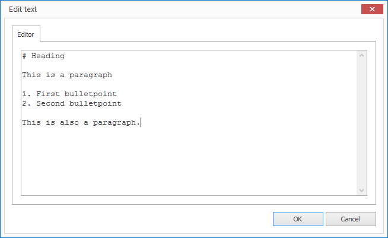

# Managing Text

If you want to repeatedly use text in the project it makes sense to add this as a Text Resource. Text can consist of simple text or formatted text. Formatted text is based on [Markdown], a very simple and intuitive markup language.

## Create a Text Resource

1. Click on `RESOURCES > Text`. A dialog window opens to select the file.
   
   

2. Enter a meaningful name for your new resource and confirm by clicking `OK`.

3. Double click on the newly created text resources in the current resource list. A text editor opens.
   
   

5. Enter your text and confirm by clicking `OK`.

[Markdown]: ../../../reference/layouts/markdown.md
