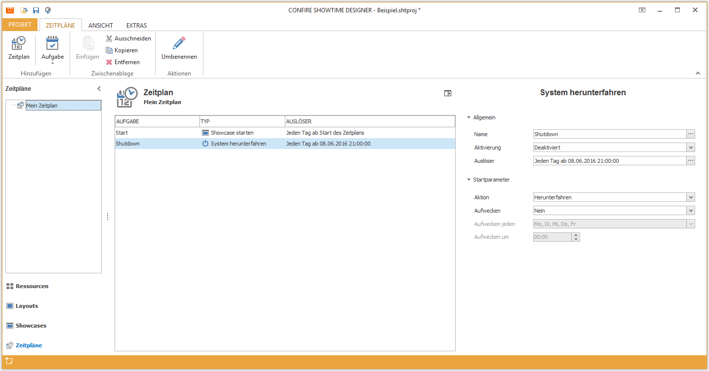

# Managing Schedules

Schedules allow you to switch between various Showcases automatically. Optionally the system can be shutdown completely at a given time. A schedule contains a list of tasks which are launched by a specific event (such as starting the Player or by a given point in time).

To use schedules click on `Schedules` in the left Navigation Panel of the Designer.

## Create Schedule

How to create a new schedule:

1. Click on `SCHEDULES > Schedule`. A dialog window opens.

2. Enter a name for your new folder and confirm by clicking `OK`.

## Edit Schedules

A schedule's only attribute is its name. To change it select `SCHEDULES > Rename`. If you want to delete a schedule just highlight it and click on  `SCHEDULES > Remove` and confirm with `Yes`.

> #### warning::Warning
> 
> Deleting a schedule will result in the deletion of all schedules and tasks contained underneath.

## Additional Chapters

* [The task "Start Schedule"](start-schedule.md)
* [The task "Start Schedule"](start-schedule.md)
* [The task "Shutdown System"](shutdown-system.md)
* [Trigger Tasks](triggers.md)

