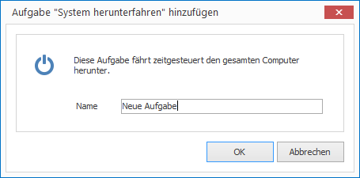
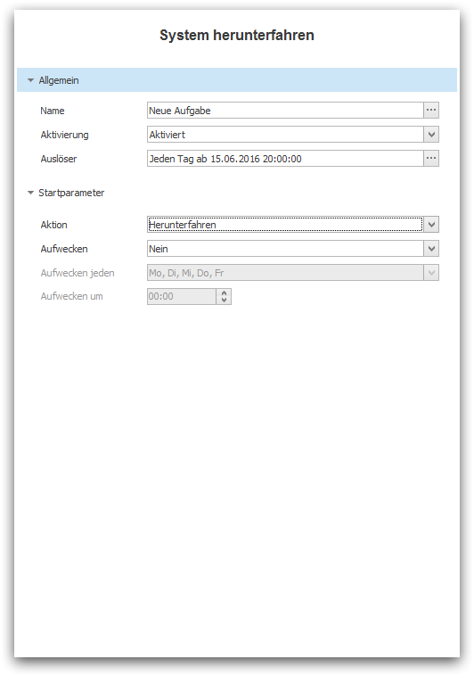

# The Task "Shutdown System"

The Task "Shutdown System" allows you to shutdown the computer that is running a project on the CONFIRE SHOWTIME PLAYER at a given time. Optionally you can set what is known as [Wake On Standby] in which you instruct the computer to start up again out of Standby at a given time.

## Create a Task

How to create a task "Shutdown System"

1. In the left navigation select `Schedules` and highlight the desired schedule which you would like to add this task to.

2. Click on `Add > Task > Shutdown System`. A dialog window opens.
   
   

3. Enter a meaningful name for your new task and confirm by clicking `OK`. The task will then appear in the list of tasks.

4. On the right side configure the desired parameters in the Properties Editor.

   
   
   * Under `Activation` you can activate the task for future launches. By default, new tasks are deactivated.

   * Under `Trigger` define the point in time when this task should be launched. See more on this topic in chapter [Trigger tasks].

   * In the group `Start Parameters` you define exactly what should happen when the system is shutdown.

## Start Parameters

You can shutdown the computer in the following ways:

* You can completely shutdown the computer, put it on Standby mode, or put it in Hibernation mode. Set the desired mode under `Action`.

* Under `Wake Up` you can specify whether the computer should start up again using [Wake On Standby]. If you select `Yes` you must specify the valid days  under `Wake Up Every` and the desired time under `Wake Up At`.

[Wake On Standby]: ../../../simple-glossary.md#wakeonstandby
[Trigger tasks]: triggers.md