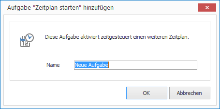
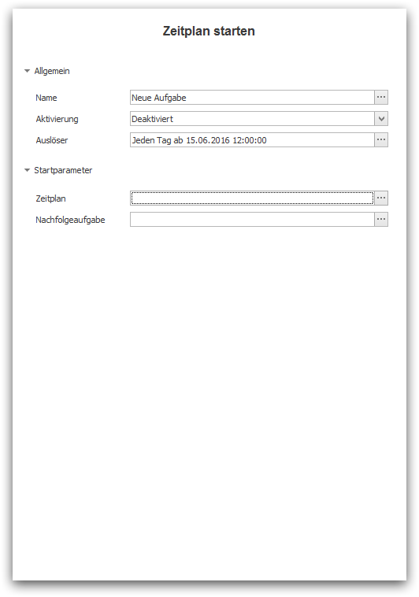

# The Task "Start Schedule"

The task "Start Schedule" allows you to activate an additional schedule at a given point in time with the option to repeat itself and if desired execute a proceeding task.

## Create a Task

How to create a task "Start Schedule"

1. In the left navigation `Schedules` highlight the desired schedule which you would like to add this task to.

2. Click on `Add > Task > Start Schedule`. A dialog window opens.
   
   

3. Enter a meaningful name for your new task and confirm by clicking `OK`. The task will then appear in the list of tasks.

4. Configure the desired parameters in the Properties Editor on the right panel.
   
   

   * Under `Activation` you can activate the task for future launches. By default, new tasks are deactivated.
  
   * Under `Trigger` you can define the point in time when this task shall be launched. For more information see chapter [Trigger Tasks].

   * In the group `Start Parameter` you define exactly what should happen when starting the Schedule.

## Start Parameters

You have the following options to start a Schedule:

* You must select the Schedule under `Schedule` which you would like to start. You will only be offered a selection of schedules belonging to the current schedule.

* Under `Next Task` define what task should be triggered immediately after completion of the schedule.
 
[Trigger Task]: triggers.md