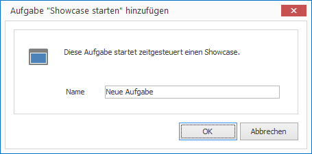
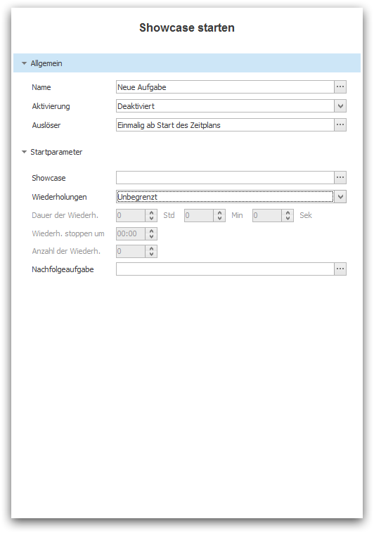

# The Task "Start Showcase"

The task "Start Showcase" allows you to start a Showcase at a given point in time with the option to repeat itself and if desired execute a proceeding task.

## Create a Task

How to create a task "Start Showcase"

1. In the left navigation `Schedules` highlight the desired schedule which you would like to add this task to.

2. Click on `Add > Task > Start Showcase`. A dialog window opens.
   
   

3. Enter a meaningful name for your new task and confirm by clicking `OK`. The task will then appear in the list of tasks.

4. Configure the desired parameters in the Properties Editor on the right panel.

   
   
   * Under `Activation` you can activate the task for future launches. By default, new tasks are deactivated.
  
   * Under `Trigger` you can define the point in time when this task shall be launched. For more information see chapter [Trigger Tasks].

   * In the group `Start Parameter` you define exactly what should happen when starting the Showcase.

## Start Parameters

You have the following options to start a Showcase:

* You must select the Showcase under `Showcase` which you would like to start.

* Under `Repeat` specify whether the Showcase
 
   1. should be triggered just once (Option: `None`)
   2. should be triggered infinitely (Option: `Unlimited`)
   3. should be triggered for a limited duration (Options: `Limited Duration` and `Limited Duration (Fixed time)`)
   4. should limit the quantity of repeats (Options: `Limited Quantity`)

* The following input masks depend on the selected mode of repeatitions and allow its configuration.

* Under `Next Task` you define what task should be launched upon  editing the Showcase.
 
[Trigger Tasks]: triggers.md