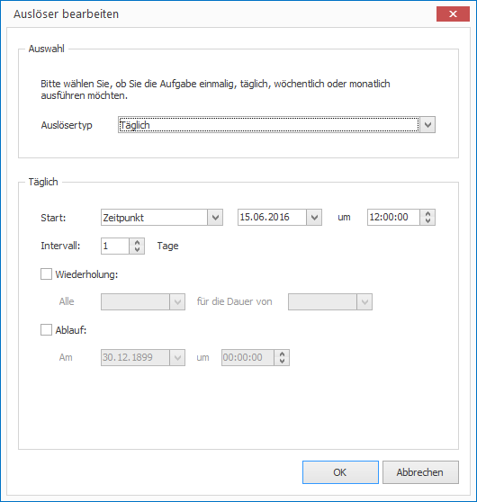

# Trigger Tasks

Triggering tasks is controlled by events. There are two kinds of events:

1. The start of the schedule
2. When a certain point in time occurs in the future

How to configure a trigger:

1. Select the desired task.

2. In the right Properties Editor click on the button with the three dots next to `Trigger`. A dialog window opens.
   
   

3. Select the desired trigger type (Once, Daily, Weekly and Monthly) and configure remaining parameters.

4. Click `OK` to confirm.
