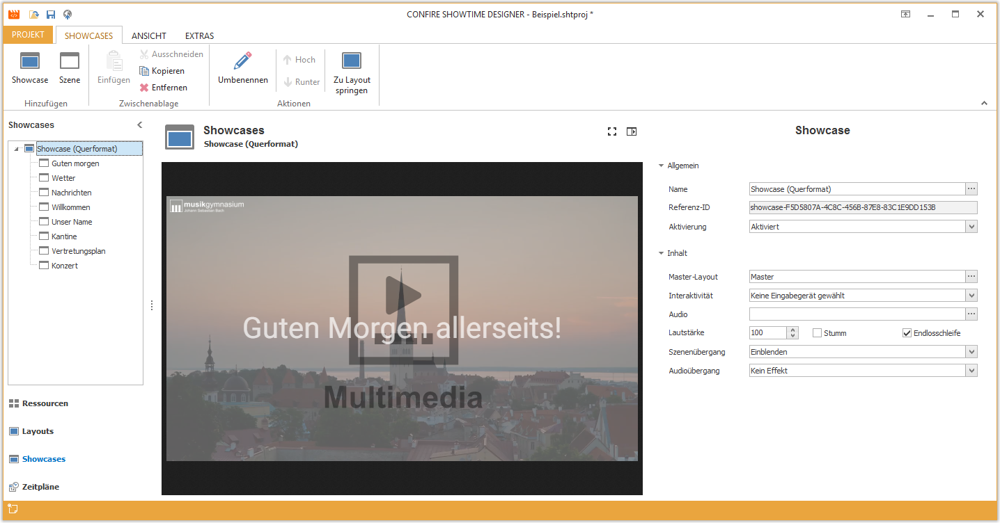

# Managing Showcases

Showcases define the timing of layouts. For this you create a sequence of scenes within a Showcase. Each scene is assigned a single layout and specifies the duration.

You can create any number of Showcases. Each Showcase is assigned a single Master Layout. The scenes available to the Showcase can only be selected from those belonging to the assigned Master Layout.

To begin working with Showcases and Scenes select `Showcases` from the left navigation bar of the Designer.

## Additional Chapters

* [Showcases](showcases.md)
* [Scenes](scenes.md)

