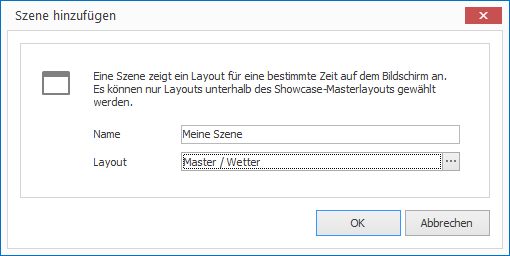

# Scenes

Scenes are part of a sequence that belong to a Showcase. Each scene is linked to a single layout and defines how long that layout should be displayed.

## Create a Scene

How to create a new scene:

1. Select a Master Layout. 

1. Click on `SHOWCASES > Scene`. A dialog window opens.

   
   
2. Enter a name for your new scene and select a layout.

3. Click `OK` to confirm.

## Properties of a Scene

All properties of a Scene can be customized on the right side in the Properties Editor:

Property        | Description
------------------ | ---------
Layout             | Refers to a layout
Time Frame         | Limited or Unlimited
Duration           | Duration of scene
Audio              | Audio played during the scene
Volume             | Volume level of video audio
Mute               | Mute video sound
Continuous Loop    | Play content continuously in a loop
