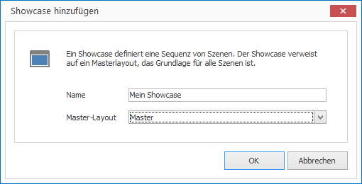

# Showcases

Showcases define the timing of layouts. In other words: A Showcase presents a sequence of layouts for a specified screen resolution. You define the screen resolution in the Master Layout.

## Create a Showcase

How to create a new Showcase:

1. Click on `SHOWCASES > Showcase`. A dialog window opens.

   

2. Enter a name for your new Showcase and select a Master Layout.

3. Click `OK` to confirm.

## Properties of a Showcase

All properties of a Showcase can be customized on the right side in the Properties Editor:

Property        | Description
------------------ | ---------
Master Layout      | Refers to a Master Layout
Interactivity      | Allow user interactivity 
Audio              | Text Editor
Volume             | Volume of video audio
Mute               | Mute video sound
Continuous Loop    | Play content continuously in a loop
Scene Transition   | Transition style when switching to next scene
Audio Transition   | Transition style when switching to next audio
