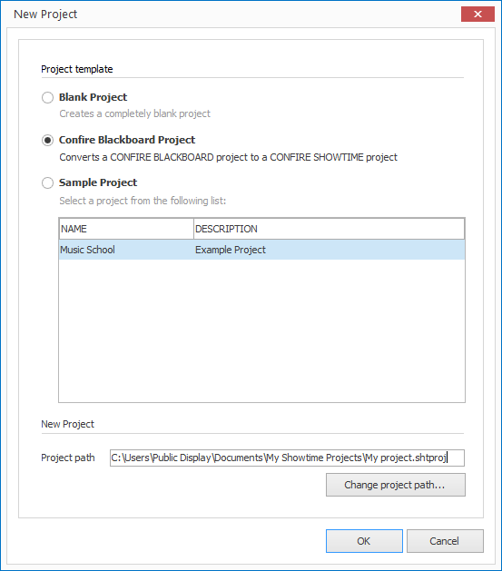

# Convert CONFIRE BLACKBOARD Projects

CONFIRE BLACKBOARD is the previous version from CONFIRE SHOWTIME. Since CONFIRE SHOWTIME is a completely new development, CONFIRE BLACKBOARD projects can not simply be opened directly. They must be converted:

1. Click on `PROJECT > New`. A dialog window opens.
   
   

2. Select the option `Confire Blackboard Project`.

3. Click on `OK`. A dialog window opens to select a file.

4. Select the desired Blackboard project and confirm with `Open`.

A new CONFIRE SHOWTIME project will now be created containing all resources and layouts from the previous  Blackboard project.

Please note the following special features when importing:

* Unsupported video formats such as WMV must be replaced with MP4 or WebM formats.

* News Tickers are converted to RSS Tickers. That means you must customize the contents of the text files. Instead of plain text CONFIRE SHOWTIME now assumes RSS Feeds as Syntax. A tutorial for formating RSS Feeds is available in chapter [Using RSS].

* Flash content will be ignored as Flash is no longer supported by CONFIRE SHOWTIME.

> #### primary::Please Note
> There is no equivalent to Showcases in CONFIRE BLACKBOARD. Therefore you will still need to complete the newly created project by creating schedules if required.

[Using RSS]: ../../../reference/layouts/rss.md