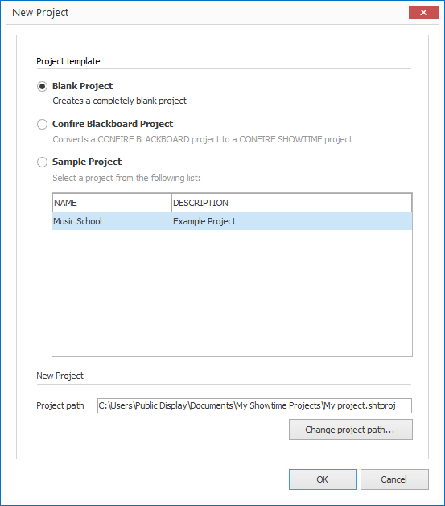

# A Blank Project 

When you want to create a new blank project just do the following:

1. Click on `PROJECT > New`. A dialog window opens.
   
   

2. Select the option `Blank project` and confirm by clicking `OK`.
