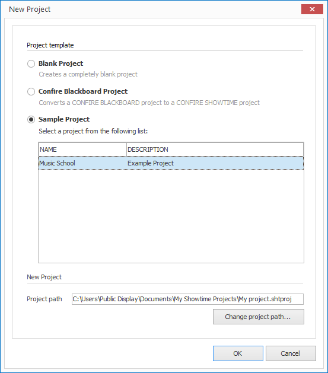

# Example Projects

Some example projects are included in the installation of CONFIRE SHOWTIME which can serve as templates for your own projects:

1. Click on  `PROJECT > New`. A dialog window will open.
   
   

2. Select the option `Example project`.

3. Highlight the desired example project and confirm by clicking `OK`.

A new CONFIRE SHOWTIME Project will now be create that contains the same content of the example template. You can then make any changes you like to the project.
