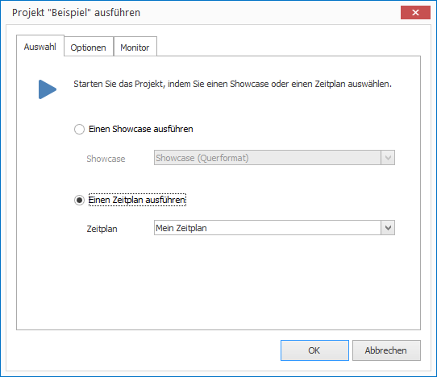
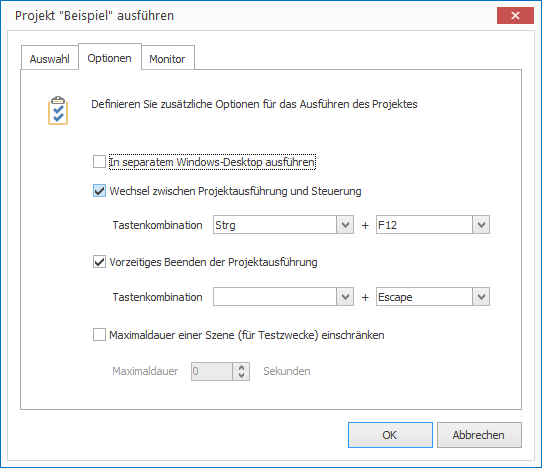
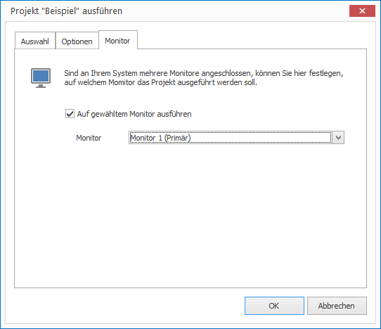

 # Start Projects in the Player

To start a project in the CONFIRE SHOWTIME PLAYER you need to either subscribe to it or open it locally. You can manage any number of local and subscribed projects in the CONFIRE SHOWTIME PLAYER. If you wish to start a project proceed as follows:

1. Click on `Projects` in the left navigation bar, in case you are unable to see the `Projects` view. 

2. Now select the desired project and click on `Play`. A dialog window opens.

3. You now need to decide:
   
   

   * If you want to play a single Showcase select the option `Start a Showcase...` and then select the desired Showcase out the list.

   * If you want to play a project via its schedule, select the option `Start a Schedule` and then select the desired schedule.

4. On the `Options` tab you can choose from the following settings:
   
   

   * The option `Run in a seperate Windows Desktop` allows the Player to be launched in a separate Windows Desktop. The advantage of this option is that only the Player is visible as an application. This avoids intruding application windows (e.g. email notifications) running simultaneously which could otherwise pop up in the foreground.

   * If the above option is activated you can select the next checkbox option to activate a key combination for switching between the Player navigation panel and the running project. A key combination of `Esc` is set by default to stop the project running.

   * The last option allows the length of the scene to be limited to a specific duration (e.g. 10 seconds). This allows a quick preview of all scenes of a Showcase for test purposes.

5. On the `Monitor` tab you can select the following settings:

   

   * Should multiple monitors be connected to the computer you can specify which monitor the Player will be run on. Tick the box `Launch project on following screen` and then select the desired screen. 

6. Confirm by clicking `OK` and the Player will then start the project.
