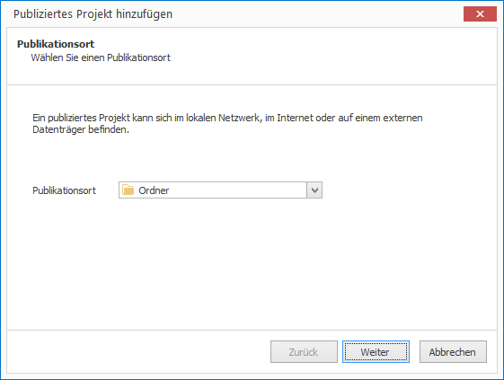
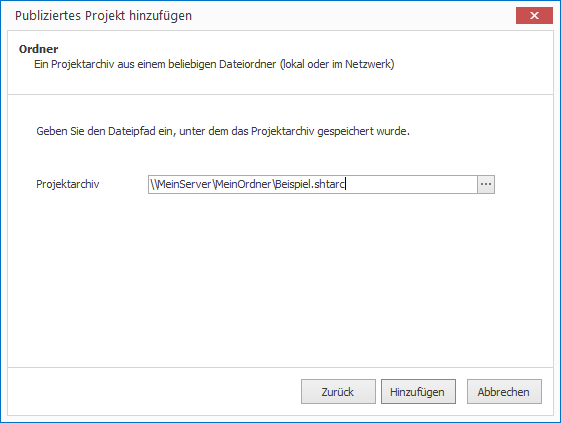
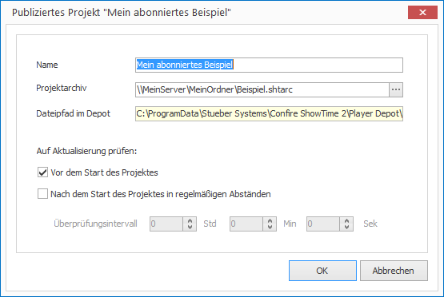

# Subscribe to Projects

Subscribing to a project allows the Player to react automatically whenever the project changes. When the project is updated it's then downloaded and the Player switches to that newer version.

Detailed information on publishing projects is available in chapter [Publishing Projects](../publish-projects/README.md).

To subscribe to a project:

1. Click on `PROJECTS > Published Project`. A wizard will open.
   
   

2. Select a publication location. You can choose between `Folder`, `FTP or WebDAV server`, `Cloud Storage Server` and `External Drive` and click `Continue`.

3. Depending on your selection in the previous step you then need to specify the project archive you wish to subscribe to. Then click `Add`.
   
   

The project is then downloaded, extracted and ready to be played. By default the Player will check for a newer version of the project before it is played. If this is the case, the current project will be replaced by the new project. You can customize this behaviour:

1. Highlight the subsribed project and click `PROJECTS > Properties`. A dialog window will open.
   
   

2. Configure when the Player should check for project updates:

   * The option `When the project starts` is selected by default.

   * The option `While the project is running` instructs the player to check for project updates at a given interval while the project is running.

