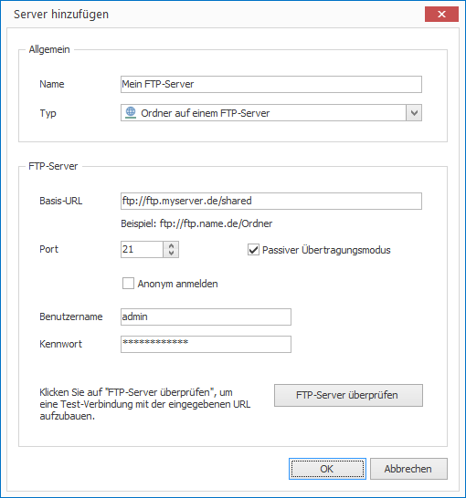
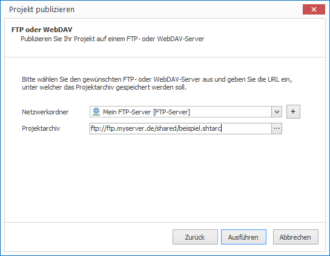

# Publish to an FTP server

To publish projects in CONFIRE SHOWTIME DESIGNER to an FTP folder you first need to define the access settings to the FTP server:

1. Click on  `Project > Manage Publication Targets > FTP and WebDAV Server`. A dialog window opens.

2. Click on `Add`.

3. Enter a name for your new Publication Target and under `Type` select `Folder on an FTP Server`.

4. Enter the necessary details of your FTP Server including login information if necessary. 

5. Click on "Test FTP Server" in order to test the access to the FTP Server.
   
   

6. If the connection test was successful click `OK`. The new FTP Server will now appear in the list of servers.

7. Click on `Close`.

Now you can publish:

1. Open the desired project.

2. Click on `Project > Publish`. A wizard will open.

3. Select the publication target `FTP or WebDAV` and click `Continue`.
   
   

4. Now select the previously defined FTP folder and click on `Publish`. 

CONFIRE SHOWTIME creates a project archive and copies it to the FTP server. As soon as you make any further changes to your project, publish it once again. CONFIRE SHOWTIME remembers the last place you saved to so that you can repeat this process with just a few clicks.

See more information on FTP publication targets in the following [Reference Chapter](../../reference/publishing/ftp.md).
