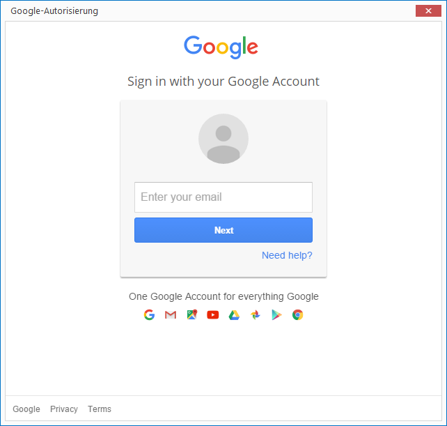
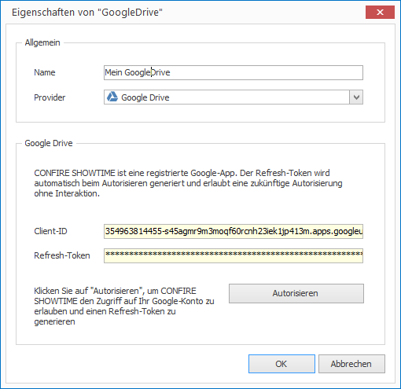
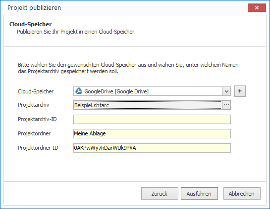

# Publish to Google Drive

To publish projects in CONFIRE SHOWTIME DESIGNER to Google Drive you need to first define the access settings to Google Drive:

1. Click on  `Project > Manage Publication Targets > Cloud Storage Service`. A dialog window opens.

2. Click on `Add`.

3. Enter a name for your new Publication Target and under `Provider` select the option `Google Drive`.

4. Click on `Authorise` to log into a Google Drive account with CONFIRE SHOWTIME. A dialog window opens.
   
   

5. Now log into Google Drive an by entering your email and password and then clicking `Sign in` to confirm. If the login is successful you then to select the button allow CONFIRE SHOWTIME access to your Google Drive account.

6. Google Drive will now generate an access key (Access-Token) allowing you to access Google Drive securely without needing to manually log in again.
   
   

6. Click on `OK`.  Google Drive will now appear in the list of Cloud Storage Services.

7. Click on `Close`.

Now you can publish:

1. Open the desired project.

2. Click on `Project > Publish`. A wizard will open.

3. Select the publication target `Cloud Storage Service` and click `Continue`.
   
   
   
4. Now select the previously defined Google Drive Storage and click on `Publish`. If you wish to change the name of the subfolder of the resulting project archive, click on the `...` button next to `Project archive`.

5. When you're happy with your selections click `Publish`. 

CONFIRE SHOWTIME creates a project archive and copies it to Google Drive. As soon as you make any further changes to your project, publish it once again. CONFIRE SHOWTIME remembers the last place you saved to so that you can repeat this process with just a few clicks.

See more information on Google Drive publication targets in the following [Reference Chapter](../../reference/publishing/googledrive.md).