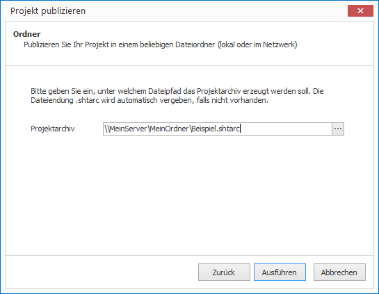

# Publish to a Local Network Drive

CONFIRE SHOWTIME DESIGNER can directly publish to the local network:

1. Open the desired project.

2. Click on `Project > Publish`. A wizard will open.

3. Select `Folder` as your publishing target and click `Continue`.

4. Specify what name to publish the project as. If desired, click on the button with three dots next to `Project archive` to open a dialog window for saving the project file.
   
   
   
5. If you're happy with your choices click on `Publish`. 

CONFIRE SHOWTIME creates a project archive and copies it to the FTP server. As soon as you make any further changes to your project, publish it once again. CONFIRE SHOWTIME remembers the last place you saved to so that you can repeat this process with just a few clicks.