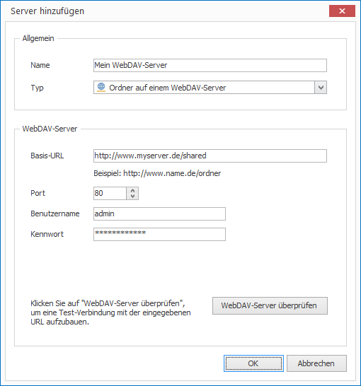
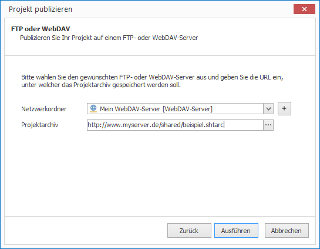

# Publish via WebDAV

To publish projects in CONFIRE SHOWTIME DESIGNER to a WebDAV folder you need to first define the access settings to the WebDAV server:

1. Click on  `Project > Manage Publication Targets > FTP and WebDAV Server`. A dialog window opens.

2. Click on `Add`.

3. Enter a name for your new publication target and under `Type` select `Folder on a WebDAV Server`.

4. Enter the necessary details of your FTP Server. 

5. Click on "Test WebDAV Server" to test access to the WebDAV server.
   
   

6. If the connection test was successful click `OK`. The new WebDAV Server will now appear in the list of servers.

7. Click on `Close`.

Now you can publish:

1. Open the desired project.

2. Click on `Project > Publish`. A wizard will open.

3. Select the publication target `FTP or WebDAV` and click `Continue`.
   
   

4. Now select the previously defined WebDAV folder and click on `Publish`.  

CONFIRE SHOWTIME creates a project archive and copies it to the FTP server. As soon as you make any further changes to your project, publish it once again. CONFIRE SHOWTIME remembers the last place you saved to so that you can repeat this process with just a few clicks.

See more information on WebDAV publication targets in the following [Reference Chapter](../../reference/publishing/webdav.md).