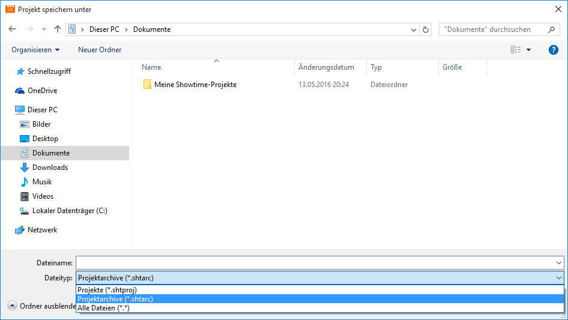

# Create Project Archives

Project archives are created directly within CONFIRE SHOWTIME DESIGNER. To create one proceed as follows:

1. Start CONFIRE SHOWTIME DESIGNER and open the desired project.

2. Click on `Project > Save As...`. A dialog window for saving files opens.

3. Select `Project archives` as file type. Project archives always have the file extension `.shtarc`

4. Enter a file name and click `Save`.

CONFIRE SHOWTIME will now create a new project archive. Depending on the size of the project this can take a moment. Once the project archive is created you can copy it, rename or send it via email.

