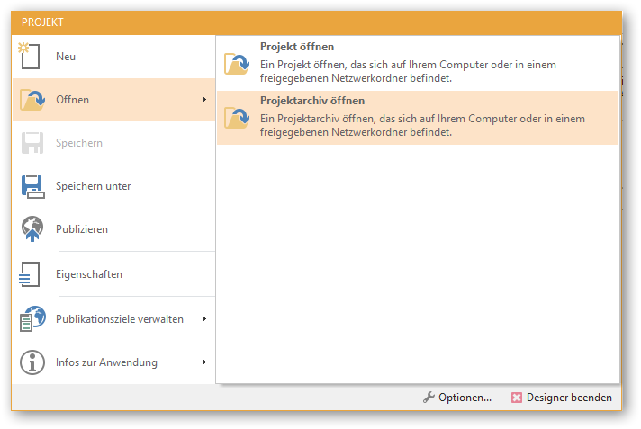
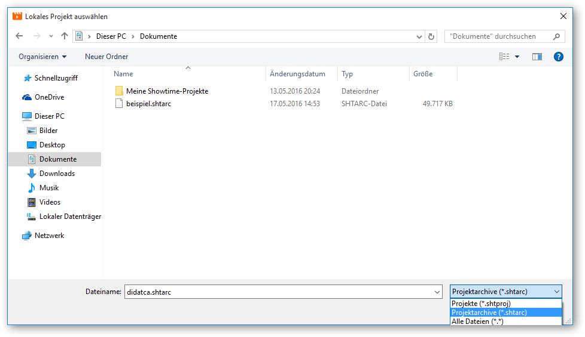

# Projektarchive öffnen

Projektarchive können Sie sowohl im CONFIRE SHOWTIME DESIGNER als auch im CONFIRE SHOWTIME PLAYER öffnen. 

## Im Designer

Gehen Sie wie folgt vor:

1. Starten Sie den CONFIRE SHOWTIME DESIGNER.

2. Klicken Sie auf `Projekt > Öffnen > Projektarchiv öffnen`. Ein Dialogfenster zum Öffnen von Dateien öffnet sich.

3. Wählen Sie die gewünschte Datei aus und klicken Sie auf `Öffnen`.

Der CONFIRE SHOWTIME DESIGNER erstellt nun ein neues Projekt, in dem es das gewählte Projektarchiv entpackt. Das Projekt wird im gleichen Verzeichnis angelegt, in dem sich auch das gewählte Projektarchiv befindet.

## Im Player

Gehen Sie wie folgt vor:

1. Starten Sie den CONFIRE SHOWTIME PLAYER.

2. Klicken Sie auf `Projekte > Lokales Projekt (Hinzufügen)`. Ein Dialogfenster zum Öffnen von Dateien öffnet sich.

3. Wählen Sie die gewünschte Datei aus und klicken Sie auf `Öffnen`.

Der CONFIRE SHOWTIME PLAYER entpackt das gewählte Projektarchiv, erstellt ein Projekt und fügt dieses in die Liste der Projekte ein. Das Projekt wird im gleichen Verzeichnis angelegt, in dem sich auch das gewählte Projektarchiv befindet.

