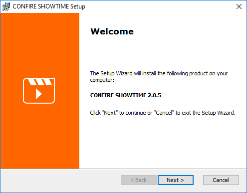
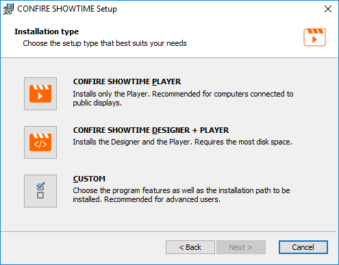
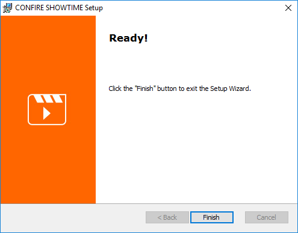

# Installation

There are two different installers for CONFIRE SHERLOCK:

* `ConfireShowtime64.msi` is the installer for 64-bit versions of Windows.
* `ConfireShowtime32.msi` is the installer for 32-bit versions of Windows.

If you're not sure which one is right for your computer try the 64-bit version first. The installer will detect whether you're attempting to install it on the wrong windows version and in which case you can then try the 32-bit version instead.

The 32-bit version of CONFIRE SHOWTIME can be installed under Windows 64-bit but not visa-versa and it's also not possible to run both versions in parallel. Either installer will detect an existing installation and advise you of that.

## Initial Installation

How to get started:

1. Open the website http://showtime.stueber.co.uk/download.php in your web browser.

2. Click on the desired download button. Your web browser will download the installer for you.

3. Double click the installer which you just downloaded. The following dialog will appear:
   
   

4. Click continue and select the installation type:
   
   

   You have three choices:
   
   * Select `CONFIRE SHOWTIME PLAYER` if wish to install just the Player but not the Designer. 
   * Select `CONFIRE SHOWTIME DESIGNER + PLAYER` if wish to install the Designer and Player.
   * Select `CUSTOM` if you want to make a more detailed selection or change the target directory.

5. Once you've decided which installation type you want, select it and follow the on-screen instructions of the install wizard.

6. At the end of the install you will be presented with the following message:
   
   

## Start Designer and Player

After a successful install you will find two new icons in your Windows start menu:

* To start CONFIRE SHOWTIME DESIGNER click on the Windows start menu and browse to the `CONFIRE SHOWTIME DESIGNER` application under `STÜBER SYSTEMS`.

* To start CONFIRE SHOWTIME PLAYER click on the Windows start menu and browse to the `CONFIRE SHOWTIME PLAYER` application under `STÜBER SYSTEMS`.

## Updating {#Updating}

To update you can use the same installer from our website as you would for first installations. The installer will automatically recognize whether it's a initial installation or an update.

How to get started:

1. Open the website http://showtime.stueber.co.uk/download.php in your web browser.

2. Click on the desired download button. Your web browser will download the installer for you.

3. Double click the installer which you just downloaded. The following dialog will appear:

3. Double click the installer which you just downloaded and follow the on-screen instructions. You don't need to select anything.

4. At the end of the install you will be presented with the following message:
   
   
   
> #### primary::Hint
> 
> Optionally you can check for updates in CONFIRE SHOWTIME DESIGNER or CONFIRE SHOWTIME PLAYER by going to `Extras > Check for updates`. If a new version if available you will be presented with the option to download and launch the installer.

## Uninstall

How to get started:

1. Open the Control Panel.

2. Click on `Programs and Features`. It may take a few moments to list all the programs.

3. Select the option `CONFIRE SHOWTIME` and click on the `Uninstall` button.

4. Follow the on-screen instructions.

