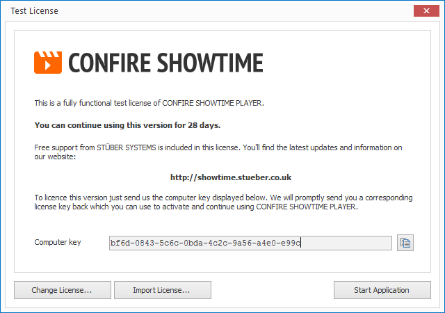
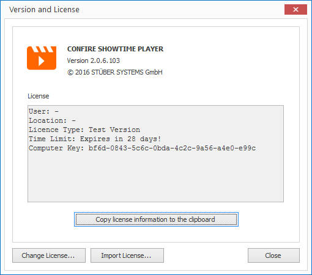

# Licensing

CONFIRE SHOWTIME consists of two parts:

* CONFIRE SHOWTIME Designer is free to use. It can be installed and used on any number of computers without any license restrictions.

* CONFIRE SHOWTIME Player requires a license for each installation. The license is limited to a selected computer.

## How to Acquire a License for the Player

When you start an unlicensed Player you will be advised of how many days left you have to use the demo version of the Player. The generated computer key is displayed in the same dialog window and is necessary for acquiring a license using the following steps:

1. Copy the computer key to the clipboard by clicking on the small copy button on the right side of the key.

2. Paste the key into an email and request a license from us at `license@stueber.de`. We will promptly generate you a license and send it back to you via email.

3. The attachment of this email contains a small XML file which you can install via `Import License`. You can also enter your license information manually via the `Change License` button.

## Review and Install the License in the Player

How to install the license:

* Click on `ENVIRONMENT`, then `Application Infos` and then on `Version and License`. A dialog window will open.

You will be presented with the current license information. You can change the license at any time using the `Import License` or `Change License` button.

